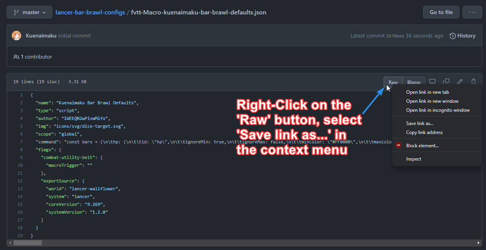
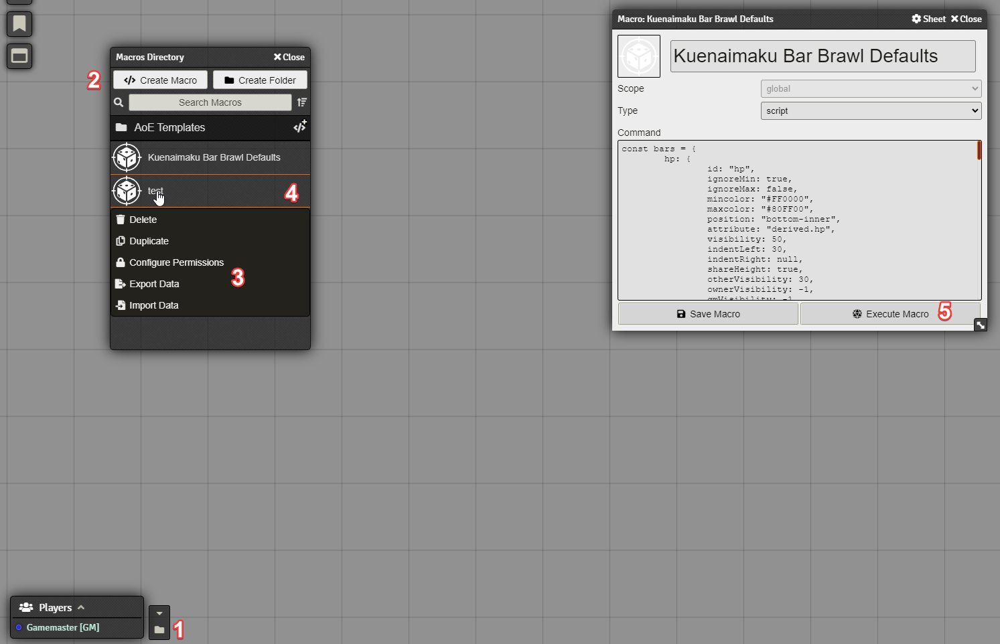
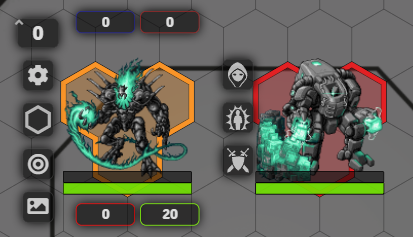
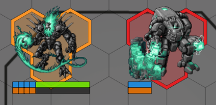
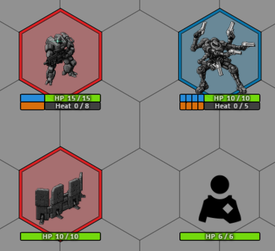

# LANCER Bar Brawl Configs
a repo containing multiple bar brawl configs intended to be used with the LANCER FoundryVTT System.

## Requirements

FoundryVTT
Bar-Brawl

## How to Use this Repo

### Github

Once you find a config you like, click on the link in the readme to be taken to the related `.json` file. From here, right-click on the "Raw" button and click "Save Link as..." option.

### FoundryVTT

1. Left-Click on this folder icon to open the `Macros Directory` menu.
2. Left-Click on the `Create Macro` button, and give your macro any name.
3. Right-Click on the new macro, and then Left-Click on `Import Data`.
4. Find the `.json` file you downloaded from this repo, and add it in the filepicker.
5. Left-Click on the macro with a new name, and click on the `Execute Macro` button.

___
## Bar Brawl Configs

### [Kuenaimaku](fvtt-Macro-kuenaimaku-bar-brawl-defaults.json)

### [Bolts](fvtt-Macro-Bolts-bar-brawl-setup.json)
Top bars:
- Overshield
- Burn

Bottom bars:
- Heat
- HP

### [Valkyrion](fvtt-Macro-Valkyrion-bar-brawl-setup-Kuen-pips.json)
Note: Requires a modification of Bar Brawl to include a `subdivisionsMatchesMax` to make "pips"

Top bars:
- Overshield
- Burn

Bottom bars:
- Structure|HP
- Stress|Heat

### [dodgepong](fvtt-Macro-bar-brawl-setup-pips-[dodgepong].json)
Notes:
* Requires [a modification of Bar Brawl to include a `subdivisionsMatchesMax` to make "pips"](https://gitlab.com/Kuenaimaku/foundryvtt-bar-brawl/-/tree/feature/approximation-matches-value-max)
* Requires the "Defaults per type" setting enabled in Bar Brawl
* Sets NPC bars to "owner-only" visibility and Mech/Pilot bars to "always visible for everyone"

**Mechs & NPCs**

Top bars:
- Overshield
- Burn

Bottom bars:
- Structure|HP
- Stress|Heat

**Pilots**

Top bar:
- Overshield

Bottom bar:
- HP

**Deployables**

Top bars:
- Overshield
- Burn

Bottom bars:
- HP
- Heat

