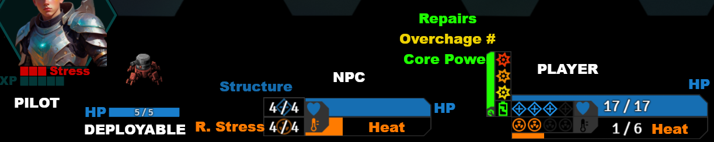
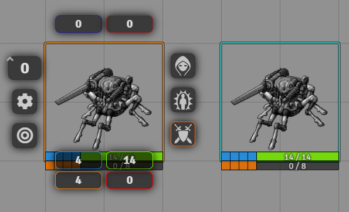
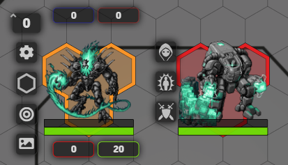
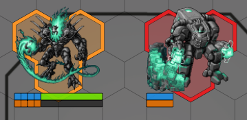
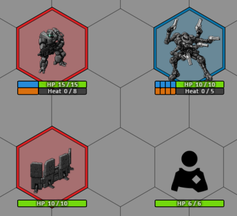

# LANCER Bar Brawl Configs
a repo containing multiple bar brawl configs intended to be used with the LANCER FoundryVTT System.

## Requirements

FoundryVTT
Bar-Brawl

## How to Use this Repo

### Github

Once you find a config you like, click on the link in the readme to be taken to the related `.json` file. From here, right-click on the "Raw" button and click "Save Link as..." option.

### FoundryVTT

1. Left-Click on this folder icon to open the `Macros Directory` menu.
2. Left-Click on the `Create Macro` button, and give your macro any name.
3. Right-Click on the new macro, and then Left-Click on `Import Data`.
4. Find the `.json` file you downloaded from this repo, and add it in the filepicker.
5. Left-Click on the macro with a new name, and click on the `Execute Macro` button.

### SubdivisionsMatchesMax Configurations

If a configuration you like mentions needing `SubdivisionsMatchesMax`, you will need a forked version of bar brawl. use the links below to download the zip corresponding with your Foundry version. use the contents inside the `src` folder to replace the contents inside your current `barbrawl` folder, generally in the following location: `\FoundryVTT\Data\modules\`

Links to download: [Foundry v10](https://github.com/Kuenaimaku/lancer-bar-brawl-configs/blob/master/barbrawl-v1.7.8.zip) | [Foundry v11](https://gitlab.com/msprijatelj/foundryvtt-bar-brawl/-/archive/v1.8.5-2-v11-extended/foundryvtt-bar-brawl-v1.8.5-2-v11-extended.zip) (thanks valkyrion!)  
___
# Bar Brawl Configs

## Version 12

### [Zenn](v11/BB_Zenn_v11)
> [!IMPORTANT]
> This configuration uses custom asset files for all player Mech and NPC stat bars that you will have to download and place in your default Foundry data directory:
> ``FoundryVTT/Data/assets/bars`` If you place the assets somewhere else, or do not place them at all, the configuration will not render.
> If you would like to place the assets somewhere else, you'll need to adjust the ``fgImage`` and ``bgImage`` properties in the included macro.

> [!TIP]
> Visit https://foundryvtt.com/article/user-data-backup/#move for information on Default User Data Locations

> [!NOTE]
> The included macro updates actors as well as tokens on scenes, but not tokens or actors stored in compendiums.
> It also returns a bunch of errors to the console while running.  If you know how to fix that, let me know! -Zenn

> [!NOTE]
> This configuration hides HP and Heat bars for NPCs outside of combat and approximates the bars into quarters to reduce player knowledge of enemy stats. To make them visible, add the NPC's to combat.
> to change this behavior, set the ``hideNoCombat:`` value to false and/or the ``subdivisions:`` value to ``""`` for ``npcBars`` ``bar1`` and ``bar2`` before triggering the macro.

  

    <h2>Version 11</h2>
  

### [Kuenaimaku](v11/BB_kuenaimaku_v11.js)

### [Bolts](v11/BB_Bolts_v11.js)
Top bars:
- Overshield
- Burn

Bottom bars:
- Heat
- HP

### [Valkyrion](v11/BB_valkyrion_v11.js)  
Notes:
* **Requires `SubdivisionsMatchesMax`**

Top bars:
- Overshield
- Burn

Bottom bars:
- Structure|HP
- Stress|Heat

### [dodgepong](v11/BB_dodgepong_v11.js)
Notes:
* **Requires `SubdivisionsMatchesMax`**
* Requires the "Defaults per type" setting enabled in Bar Brawl
* Sets NPC bars to "owner-only" visibility and Mech/Pilot bars to "always visible for everyone"

**Mechs & NPCs**

Top bars:
- Overshield
- Burn

Bottom bars:
- Structure|HP
- Stress|Heat

**Pilots**

Top bar:
- Overshield

Bottom bar:
- HP

**Deployables**

Top bars:
- Overshield
- Burn

Bottom bars:
- HP
- Heat

### [Zenn](v11/BB_Zenn_v11)
> [!IMPORTANT]
> This configuration uses custom asset files for all player Mech and NPC stat bars that you will have to download and place in your default Foundry data directory:
> ``FoundryVTT/Data/assets/bars`` If you place the assets somewhere else, or do not place them at all, the configuration will not render.
> If you would like to place the assets somewhere else, you'll need to adjust the ``fgImage`` and ``bgImage`` properties in the included macro.

> [!TIP]
> Visit https://foundryvtt.com/article/user-data-backup/#move for information on Default User Data Locations

> [!NOTE]
> The included macro updates actors as well as tokens on scenes, but not tokens or actors stored in compendiums.
> It also returns a bunch of errors to the console while running.  If you know how to fix that, let me know! -Zenn

> [!NOTE]
> This configuration hides HP and Heat bars for NPCs outside of combat and approximates the bars into quarters to reduce player knowledge of enemy stats. To make them visible, add the NPC's to combat.
> to change this behavior, set the ``hideNoCombat:`` value to false and/or the ``subdivisions:`` value to ``""`` for ``npcBars`` ``bar1`` and ``bar2`` before triggering the macro.

  

    <h2>Version 10</h2>
  

### [Kuenaimaku](v10/fvtt-Macro-kuenaimaku-bar-brawl-defaults.json)

### [Bolts](v10/fvtt-Macro-Bolts-bar-brawl-setup.json)
Top bars:
- Overshield
- Burn

Bottom bars:
- Heat
- HP

### [Valkyrion](v10/fvtt-Macro-Valkyrion-bar-brawl-setup-Kuen-pips.json)  
Notes:
* **Requires `SubdivisionsMatchesMax`**

Top bars:
- Overshield
- Burn

Bottom bars:
- Structure|HP
- Stress|Heat

### [dodgepong](v10/fvtt-Macro-bar-brawl-setup-pips-[dodgepong].json)
Notes:
* **Requires `SubdivisionsMatchesMax`**
* Requires the "Defaults per type" setting enabled in Bar Brawl
* Sets NPC bars to "owner-only" visibility and Mech/Pilot bars to "always visible for everyone"

**Mechs & NPCs**

Top bars:
- Overshield
- Burn

Bottom bars:
- Structure|HP
- Stress|Heat

**Pilots**

Top bar:
- Overshield

Bottom bar:
- HP

**Deployables**

Top bars:
- Overshield
- Burn

Bottom bars:
- HP
- Heat

