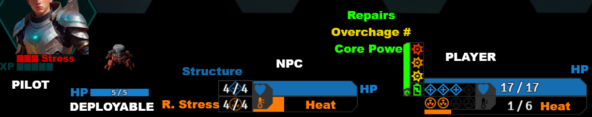

> [!IMPORTANT]
> This configuration uses custom asset files for all player Mech and NPC stat bars that you will have to download and place in your default Foundry data directory:
> ``FoundryVTT/Data/assets/bars`` If you place the assets somewhere else, or do not place them at all, the configuration will not render.
> If you would like to place the assets somewhere else, you'll need to adjust the ``fgImage`` and ``bgImage`` properties in the included macro.

> [!TIP]
> Visit https://foundryvtt.com/article/user-data-backup/#move for information on Default User Data Locations

> [!NOTE]
> This configuration hides HP and Heat bars for NPCs outside of combat. To make them visible, add the NPC's to combat.
> to change this behavior, set the ``hideNoCombat:`` value to false for ``npcBars`` ``bar1`` and ``bar2`` before triggering the macro.

INSTALL STEPS

1. Save the .svg files to ``FoundryVTT/Data/assets/bars`` folder
2. Open ``ZennBarBrawlConfigV11.js`` and copy the contents. 
3. Paste them to a new macro in Foundry, make sure to select ``Script`` from the Type dropdown.
4. Save and Execute the macro. 

